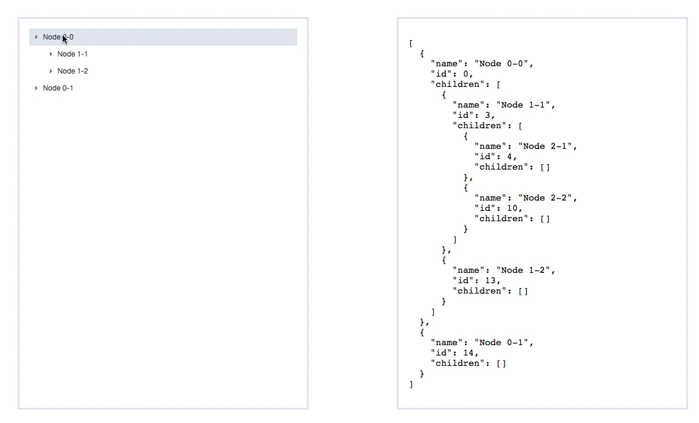

# vue-drag-tree

[](https://www.npmjs.com/package/vue-drag-tree)[](https://www.npmjs.com/package/vue-drag-tree)[](https://opensource.org/licenses/MIT)

> It's a tree components(Vue2.x) that allow you to drag and drop the node to exchange their data .

**Feature**

- **Double click** on an node to turn it into a folder
- **Drag and Drop** the tree node, even between two different levels
- **Controls** whether a particular node can **be dragged** and whether the node can be plugged into other nodes
- **Append/Remove** Node in any level (#TODO)

**[中文](README_ZH.md)** || **Please Star! if it's helpful**.

### Preview

---



### Getting Start

---

**Install**

`npm install vue-drag-tree --save`

**Usage**

[A Simple Project Using vue-drag-tree](https://github.com/shuiRong/vue-drag-tree-demo)


main.js

```vue
import Vue from 'vue'
import VueDragTree from 'vue-drag-tree'

Vue.component('vue-drag-tree', VueDragTree)
```

test.vue

```vue
<template>
	<vue-drag-tree :data='data' :allowDrag='allowDrag' :allowDrop='allowDrop' :defaultText='"New Node"' @current-clicked='curNodeClicked' @drag="dragHandler" @drag-enter="dragEnterHandler" @drag-leave="dragLeaveHandler" @drag-over="dragOverHandler" @drag-end="dragEndHandler" @drop="dropHandler">
    </vue-drag-tree>
</template>
<script>
export default{
  data(){
    return{
      data: [
        {
          name: 'Node 0-0',
          id: 0,
          children: [
            {
              name: 'Node 1-1',
              id: 3,
              children: [
                {
                  name: 'Node 2-1',
                  id: 4,
                  children: []
                },
                {
                  name: 'Node 2-2',
                  id: 10,
                  children: []
                }
              ]
            },
            {
              name: 'Node 1-2',
              id: 13,
              children: []
            }
          ]
        },
        {
          name: 'Node 0-1',
          id: 14,
          children: []
        }
      ]
    }
  },
  methods: {
   	allowDrag(model, component) {
      if (model.name === 'Node 0-1') {
        // can't be dragged
        return false;
      }
      // can be dragged
      return true;
    },
    allowDrop(model, component) {
      if (model.name === 'Node 2-2') {
        // can't be placed
        return false;
      }
      // can be placed
      return true;
    },
    curNodeClicked(model, component) {
      // console.log('curNodeClicked', model, component);
    },
    dragHandler(model, component, e) {
      // console.log('dragHandler: ', model, component, e);
    },
    dragEnterHandler(model, component, e) {
      // console.log('dragEnterHandler: ', model, component, e);
    },
    dragLeaveHandler(model, component, e) {
      // console.log('dragLeaveHandler: ', model, component, e);
    },
    dragOverHandler(model, component, e) {
      // console.log('dragOverHandler: ', model, component, e);
    },
    dragEndHandler(model, component, e) {
      // console.log('dragEndHandler: ', model, component, e);
    },
    dropHandler(model, component, e) {
      // console.log('dropHandler: ', model, component, e);
    }
  }
}
<script>
```

### API

---

**Attributes**

| Name        | Description                                        | Type     | Default  |
| :---------- | :------------------------------------------------- | :------- | :------- |
| data        | data of the tree                                   | Array    | －－     |
| defaultText | 新生成的节点的文本(name属性)                       | String   | 新增节点 |
| allowDrag   | Judging which node can be dragged                  | Function | ()=>true |
| allowDrop   | Judging which node can be plugged into other nodes | Function | ()=>true |


**Method**

| Name            | Description                                                  | arguments                                                    |
| --------------- | ------------------------------------------------------------ | ------------------------------------------------------------ |
| current-clicked | Tell you which node was clicked                              | (model,component) model:  node data was clicked． component: VNode data for the node was clicked |
| drag            | The `drag` event is fired every few hundred milliseconds as an node is being dragged by the user | (model,component,e) model: node data was dragged. component: VNode data for the node was dragged; e: drag event |
| drag-enter      | The `drag-enter` event is fired when a dragged node enters a valid drop target | (model,component,e) model: data of the valid drop target; component: VNode of the valid drop target; e: drag event |
| drag-leave      | The `drag-leave` event is fired when a dragged node leaves a valid drop target | (model,component,e) model: data of the valid drop target; component: VNode of the valid drop target; e: drag event |
| drag-over       | The `drag-over` event is fired when an node is being dragged over a valid drop target | (model,component,e) model: data of the valid drop target; component: VNode of the valid drop target; e: drag event |
| drag-end        | The `drag-end` event is fired when a drag operation is being ended | (model,component,e) model: node data was dragged. component: VNode data for the node was dragged; e: drag event |
| drop            | The **drop** event is fired when an node is dropped on a valid drop target. | (model,component,e) model: data of the valid drop target; component: VNode of the valid drop target; e: drag event |


**License**

---

[MIT](LICENSE)
